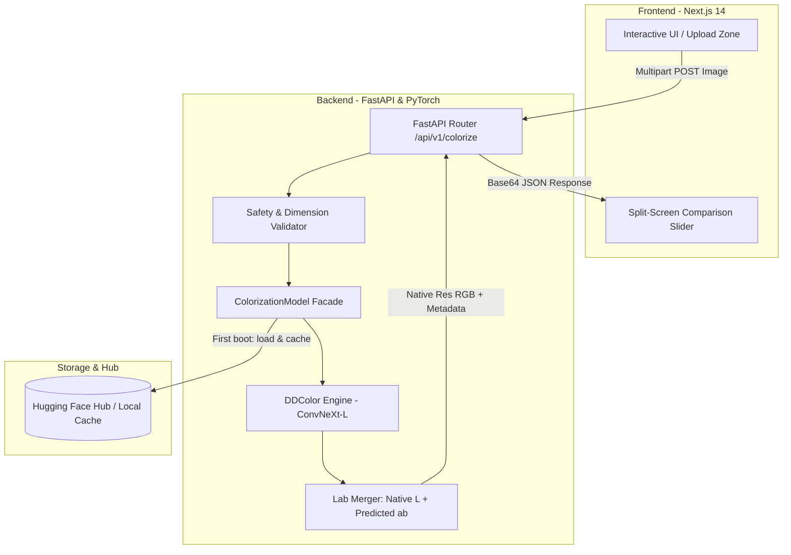

# ColorRevive — Production AI Black-and-White Photo Colorization

**ColorRevive** converts black-and-white and historical grayscale photographs into realistic, natural-color images using **DDColor** (*Dual Decoder Colorization*, ICCV 2023), a state-of-the-art deep-learning architecture.

DDColor performs true **semantic color prediction** — generating authentic skin tones, natural hair, sky blues, lush foliage greens, and material colors, completely replacing unprincipled heuristic tinting.

---

## Highlights

- **Pretrained DDColor Deep Learning Model**: Employs ConvNeXt-Large encoder with dual decoders (Pixel Decoder for spatial structure + Color Decoder with cross-attention queries).
- **Semantic Color Accuracy**: Infers natural colors from visual semantics rather than hard-coded luminance lookup tables or monochrome tints.
- **Original Resolution & Luminance Preserved**: Native image dimensions are completely preserved (e.g., 600×900 in → 600×900 out); the original $L$-channel from CIE Lab space is combined with predicted chrominance ($a, b$) to retain 100% of the original contrast and details.
- **Automatic Model Downloads**: Hugging Face Hub downloads and caches official weights (`piddnad/ddcolor_modelscope`, 227.8M parameters) upon first launch.
- **CPU & NVIDIA GPU (CUDA) Ready**: Automatic hardware detection (`DEVICE=auto`), explicit CUDA acceleration, or CPU fallback.
- **Zero Fake Fallback in Production**: `ENABLE_FALLBACK_MODE=false` by default. Returns explicit `MODEL_UNAVAILABLE` errors if model assets cannot be loaded rather than passing off heuristic tints as AI.
- **Interactive UI with Comparison Slider**: Next.js 14 frontend with interactive before/after split slider, zoom, drag-and-drop, and client-side validation.

---

## Architecture Overview



### End-to-End Processing Flow

```
Input Image (RGB uint8, e.g. 500 × 644)
    │
    ├─ 1. Validation & Safety Checks (Format, Dimensions, Decompression Bomb guard)
    ├─ 2. Preserve Original Resolution & Extract Original CIE Lab L-channel
    ├─ 3. Resize Grayscale representation to Model Input (512×512 or 768×768)
    ├─ 4. DDColor Deep Neural Network Forward Pass (ConvNeXt-Large + Dual Decoders)
    ├─ 5. Predict Chrominance (a, b channels in [-128, 127])
    ├─ 6. Bilinearly Upsample Predicted (a, b) back to Original Resolution (500 × 644)
    ├─ 7. Recombine with Original 100% Native L-channel
    ├─ 8. Convert CIE Lab → RGB uint8
    │
Output Image (RGB uint8, exact 500 × 644, Natural Skin / Foliage / Sky Colors)
```

---

## Quickstart

### Prerequisites
- **Node.js**: v18+ (v20+ recommended)
- **Python**: 3.10, 3.11, or 3.12
- Optional: NVIDIA GPU with CUDA driver (11.8+ / 12.x)

---

### 1. Start the Backend API

```bash
cd colorrevive/backend

# Create and activate virtual environment
python -m venv .venv

# Windows (PowerShell)
.\.venv\Scripts\Activate.ps1

# Linux / macOS
source .venv/bin/activate

# Install dependencies (FastAPI, PyTorch, Hugging Face Hub, OpenCV, Timm)
pip install -r requirements.txt

# Run the API server on port 8001
uvicorn app.main:app --host 127.0.0.1 --port 8001
```

*Note: On first boot, `piddnad/ddcolor_modelscope` (~500 MB) is automatically downloaded from Hugging Face and cached locally.*

API endpoints available:
- **Swagger Documentation**: http://127.0.0.1:8001/docs
- **Health Check**: http://127.0.0.1:8001/health
- **Model Status**: http://127.0.0.1:8001/api/v1/model-status
- **Service Info**: http://127.0.0.1:8001/api/v1/info

---

### 2. Start the Frontend

```bash
cd colorrevive/frontend

# Install dependencies
npm install

# Run the development server
npm run dev
```

Open **http://localhost:3000** in your web browser.

---

## Docker & Docker Compose

### CPU Execution (Default)
```bash
cd colorrevive
docker compose up --build
```
Runs the Next.js frontend on `http://localhost:3000` and the CPU backend on `http://localhost:8001`.

### NVIDIA GPU (CUDA) Execution
```bash
cd colorrevive
docker compose --profile gpu up --build
```
Requires the [NVIDIA Container Toolkit](https://docs.nvidia.com/datacenter/cloud-native/container-toolkit/latest/install-guide.html). Automatically assigns the GPU to `colorrevive-backend-gpu`.

---

## Configuration

Settings are controlled via environment variables:

| Variable | Default | Description |
|---|---|---|
| `COLORIZATION_ENGINE` | `ddcolor` | Model engine (`ddcolor`) |
| `DDCOLOR_MODEL` | `piddnad/ddcolor_modelscope` | Model variant: `ddcolor_modelscope` (vibrant), `ddcolor_paper` (balanced natural), `ddcolor_artistic` |
| `DDCOLOR_INPUT_SIZE` | `512` | Standard quality inference resolution |
| `DDCOLOR_INPUT_SIZE_HIGH` | `768` | High quality inference resolution |
| `COLOR_CHROMA_STRENGTH` | `1.0` | Chrominance scaling (1.0 = raw prediction, 0.85 = subtle natural) |
| `COLOR_BLACK_PRESERVE` | `true` | Preserves deep shadows and highlights by attenuating chroma at luminance extremes |
| `DEVICE` | `auto` | Execution device: `auto`, `cuda`, or `cpu` |
| `ENABLE_FALLBACK_MODE` | `false` | Fallback heuristic disabled by default in production |
| `MAX_UPLOAD_MB` | `10` | Maximum upload size in megabytes |
| `MAX_IMAGE_PIXELS` | `25000000` | Safety limit preventing decompression attacks |
| `INFERENCE_TIMEOUT_SECONDS`| `120` | Server-side inference timeout |
| `NEXT_PUBLIC_API_BASE_URL` | `http://localhost:8001` | Backend URL for frontend client |

---

## Verification & Testing

### Backend Unit & Integration Tests (Pytest)
```bash
cd colorrevive/backend
python -m pytest
```
*Executes 27 tests including health checks, model status, DDColor inference, input size preservation, and accidental monochrome detection.*

### Frontend Tests & Typecheck (Vitest)
```bash
cd colorrevive/frontend
npm test
npm run build
```
*Executes 28 vitest tests verifying UI components, comparison slider, upload validation, and full Next.js static build compilation.*

---

## License

This project is licensed under the Apache 2.0 License. The DDColor model architecture and weights are developed by [piddnad/DDColor](https://github.com/piddnad/DDColor) (ICCV 2023).
