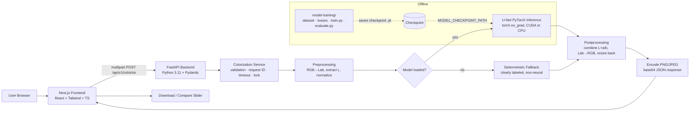

# ColorRevive — AI Black-and-White Image Colorization

**ColorRevive** converts black-and-white or grayscale photographs into realistic color images using a deep-learning model that predicts chrominance in the CIE Lab color space.

> ⚠️ **Important limitation:** Colorization is an AI *prediction*. The original colors are unknowable from a grayscale image, so generated colors may not match historical reality. Do not treat outputs as evidence of original colors.

> **Current status:** No trained checkpoint ships with this repository. Out of the box the app runs in **deterministic fallback mode** (a clearly labeled, non-neural color enhancement). Set `MODEL_CHECKPOINT_PATH` to a trained U-Net checkpoint to enable real deep-learning inference. The UI and API always report which mode is active — see [Fallback vs. Real Model](#fallback-vs-real-model).

---

## Table of Contents

1. [Features](#features)
2. [Architecture Overview](#architecture-overview)
3. [How It Works (End-to-End Flow)](#how-it-works-end-to-end-flow)
4. [The ML Pipeline: Why Lab Color Space?](#the-ml-pipeline-why-lab-color-space)
5. [Model Architecture (U-Net)](#model-architecture-u-net)
6. [Fallback vs. Real Model](#fallback-vs-real-model)
7. [Repository Structure](#repository-structure)
8. [API Reference](#api-reference)
9. [Local Setup & Running](#local-setup--running)
10. [Configuration (Environment Variables)](#configuration-environment-variables)
11. [Training Your Own Model](#training-your-own-model)
12. [Testing](#testing)
13. [Deployment](#deployment)
14. [Security & Privacy](#security--privacy)
15. [Troubleshooting](#troubleshooting)
16. [License](#license)

---

## Features

- **Drag-and-drop upload** of JPG / PNG / WEBP images (client + server validation, 10 MB default limit)
- **Real inference pipeline**: RGB → Lab → L-channel → U-Net → predicted a/b channels → RGB
- **Before/after comparison slider** — keyboard accessible (arrow keys), touch + pointer draggable
- **Settings panel**: quality, preserve contrast, denoise, output format (PNG/JPEG) — every control maps to a real backend parameter
- **Side-by-side results**, image metadata, and one-click downloads (`colorrevive-<original-name>-colorized.png`)
- **Honest fallback mode** when no checkpoint is present — labeled everywhere, never passed off as AI
- **Structured error handling** with request IDs; no stack traces leak to users
- **Responsive & accessible**: WCAG 2.1 AA principles, ARIA live regions for processing status, reduced-motion support, dark/light theme
- **Tested**: Pytest (backend + ML utilities), Vitest + React Testing Library (frontend), Playwright smoke test
- **Dockerized**: `docker-compose.yml` runs frontend + backend together

---

## Architecture Overview

ColorRevive is a three-tier monorepo with strict separation between the web client, the inference API, and the offline training pipeline.



### Component responsibilities

| Layer | Tech | Responsibility |
|---|---|---|
| **Frontend** (`colorrevive/frontend`) | Next.js App Router, TypeScript, Tailwind CSS, Lucide icons | Upload UX, validation, settings, progress states, comparison slider, downloads, history panel |
| **Backend API** (`colorrevive/backend`) | FastAPI, Uvicorn, Pydantic | HTTP layer, multipart parsing, file-type/MIME/pixel-count validation, CORS, structured logging, safe errors |
| **ML service** (`backend/app/ml`) | PyTorch, OpenCV, Pillow, NumPy, scikit-image | Preprocessing, U-Net definition, checkpoint loading, inference, postprocessing, fallback logic |
| **Training pipeline** (`colorrevive/model-training`) | PyTorch, PyYAML, TensorBoard | Dataset loading (any folder of RGB images), Lab-space targets, training loop, checkpoints, evaluation metrics |

Key design decisions:

- **The model is loaded once at startup** (or lazily exactly once), never per-request, guarded by an inference lock for CPU safety.
- **The API never imports training code** at runtime — `model-training/` is fully offline.
- **Response strategy is configurable**: base64-in-JSON works everywhere (local dev, serverless); the shape carries `fallback_mode`, `model`, `processing_time_ms`, and dimensions.
- **Swappable model**: `ColorizationModel` exposes `load() / predict(l_channel) / is_loaded() / metadata()`. A ResNet-encoder variant can replace the U-Net without touching any endpoint code.

---

## How It Works (End-to-End Flow)

```
Uploaded image
    │
    ├─ 1. Validate MIME type + extension + size + pixel count (decompression-bomb guard)
    ├─ 2. Decode safely with Pillow (corrupt files rejected → INVALID_IMAGE)
    ├─ 3. Convert to RGB, preserve original dimensions
    ├─ 4. Resize to model input (256×256) for inference
    ├─ 5. Convert RGB → CIE Lab
    ├─ 6. Extract L channel, scale to [−1, 1]
    ├─ 7. U-Net predicts normalized a and b chrominance channels
    │      (or deterministic fallback if no checkpoint)
    ├─ 8. Denormalize a/b, combine with original L
    ├─ 9. Convert Lab → RGB
    ├─ 10. Upsample back to ORIGINAL dimensions (aspect ratio preserved)
    ├─ 11. Optional: preserve-contrast (CLAHE), denoise (fast NLM)
    ├─ 12. Clamp pixels to valid range
    └─ 13. Encode PNG/JPEG → JSON response with request_id + timing
```

What the user sees:

1. Drop an image → instant preview with dimensions/file size.
2. Pick settings → click **Colorize**.
3. Status messages advance through *Uploading → Preparing image → Running model → Post-processing → Preparing download* via an ARIA live region.
4. Result appears with side-by-side views, a draggable before/after slider, metadata (model used, time taken, fallback badge if applicable), and download buttons.

---

## The ML Pipeline: Why Lab Color Space?

CIE Lab separates **lightness (L)** from **color information (a = green↔red, b = blue↔yellow)**. This matters because:

- A grayscale photo already contains (approximately) the correct L channel — structure, edges, shading are intact.
- The model therefore only needs to solve the *hard but well-scoped* problem: **predict two chrominance channels conditioned on luminance and surrounding context**.
- Predicting a/b directly in RGB would force the network to hallucinate brightness detail it must then throw away.

Normalization details (see `backend/app/ml/preprocessing.py`):

- L is scaled to **[−1, 1]** (matches U-Net's `tanh` output activation).
- a and b are divided by **128** and clipped to roughly [−1, 1], matching the network's bounded outputs; the inverse happens in postprocessing.
- The output L is the *input* L (with optional contrast preservation), so fine luminance detail is never degraded by the network.

---

## Model Architecture (U-Net)

Defined in `backend/app/ml/model.py` (mirrored for training in `model-training/src/model.py`):

```yaml
model_name: unet-lab-v1
input_channels: 1      # L channel
output_channels: 2     # predicted a, b
base_channels: 64
image_size: 256
```

```
Input L (1×256×256)
   │
ENCODER                          DECODER
conv-B-R 64      ─── skip ───   up → concat → conv-B-R 64 → 2ch out (tanh)
pool conv-B-R 128 ── skip ──   up → concat → conv-B-R 128
pool conv-B-R 256 ── skip ──   up → concat → conv-B-R 256
pool conv-B-R 512 ──── bottleneck (conv-B-R 512) ───┘
```

Each block: `Conv3×3 → GroupNorm → LeakyReLU(0.2)` ×2. Skip connections preserve spatial detail; `tanh` bounds outputs so predictions stay in normalized Lab range. Loss during training: **L1 on a/b channels** (perceptual loss hooks are stubbed structurally, documented as future work).

---

## Fallback vs. Real Model

The system distinguishes three states explicitly — and reports them in `/health`, `/api/v1/model-status`, `/api/v1/info`, and in the UI banner:

| State | Meaning | How to get there |
|---|---|---|
| **App shell** | UI/API fully functional, no image processed | start servers without uploading |
| **Fallback mode** ✅ default | Deterministic, classical CV color enhancement (luminance-mapped tinting). **Not neural, not "AI-generated."** Output is reproducible and clearly badged. | Default — no checkpoint found |
| **Real inference** | Trained U-Net predicts a/b channels from the L channel | Train via `model-training/` and set `MODEL_CHECKPOINT_PATH=/path/to/colorization.pt` |

If `MODEL_CHECKPOINT_PATH` points to a missing/incompatible file, the backend logs the failure, falls back safely, and reports `fallback_mode: true` — it never silently pretends a model loaded.

---

## Repository Structure

```
.
├── README.md                      ← you are here
├── .gitignore
└── colorrevive/
    ├── frontend/                  Next.js App Router + TypeScript + Tailwind
    │   ├── app/                   layout.tsx, page.tsx, globals.css
    │   ├── components/            upload-zone, image-preview, comparison-slider,
    │   │                          settings-panel, processing-state, result-actions,
    │   │                          history-panel, theme-toggle
    │   ├── lib/                   api.ts, types.ts, utils.ts
    │   └── tests/                 Vitest + React Testing Library
    ├── backend/                   FastAPI service
    │   ├── app/
    │   │   ├── main.py            app factory, CORS, startup model load
    │   │   ├── config.py          env-driven settings (Pydantic)
    │   │   ├── schemas.py         request/response models, error envelope
    │   │   ├── api/               health.py, colorize.py (v1 routes)
    │   │   ├── services/          colorization_service, image_service, storage_service
    │   │   ├── ml/                model.py, inference.py, preprocessing.py,
    │   │   │                      postprocessing.py, checkpoint_loader.py
    │   │   └── utils/             logging.py (structured), errors.py (safe codes)
    │   ├── tests/                 pytest suite
    │   └── requirements.txt
    ├── model-training/            offline training pipeline
    │   ├── src/                   dataset.py, model.py, losses.py, train.py,
    │   │                          evaluate.py, inference.py
    │   ├── configs/config.yaml    all hyperparameters
    │   └── notebooks/
    ├── sample-data/               demo grayscale images
    └── docs/                      architecture.md, api.md, model-card.md
```

---

## API Reference

Base URL: `http://localhost:8000` (Swagger UI at `/docs`).

| Method | Path | Purpose |
|---|---|---|
| `GET` | `/health` | Liveness + dynamic `model_loaded`, `device`, `fallback_mode` |
| `GET` | `/api/v1/info` | App name, version, supported formats, max upload size, model name, fallback status |
| `GET` | `/api/v1/model-status` | Model name, loaded state, device, precision, version, fallback status |
| `POST` | `/api/v1/colorize` | Multipart upload (`image`, `quality`, `preserve_contrast`, `face_enhancement`, `denoise`, `output_format`) → JSON with base64 image + metadata |
| `POST` | `/api/v1/validate-image` | Preflight check: decode, dimensions, corruption — no inference |

Success response (excerpt):

```json
{
  "success": true,
  "request_id": "6f0d…",
  "filename": "photo-colorized.png",
  "mime_type": "image/png",
  "width": 1200, "height": 800,
  "processing_time_ms": 842,
  "model": "unet-lab-v1",
  "fallback_mode": false,
  "image_base64": "…"
}
```

Error envelope (consistent across all failures — `INVALID_IMAGE`, `FILE_TOO_LARGE`, `UNSUPPORTED_FORMAT`, `EMPTY_FILE`, `MODEL_UNAVAILABLE`, `TIMEOUT`, `INTERNAL_ERROR`):

```json
{ "success": false, "error": { "code": "INVALID_IMAGE", "message": "…safe text…", "request_id": "uuid" } }
```

Full details in `colorrevive/docs/api.md`.

---

## Local Setup & Running

### Prerequisites

- Node.js ≥ 18, Python ≥ 3.11, (optional) Docker + Compose

### One command (recommended)

```bash
cd colorrevive
make install     # pip install -r backend/requirements.txt && npm ci in frontend
make backend     # uvicorn app.main:app --port 8000   (from colorrevive/backend)
make frontend    # npm run dev                        (from colorrevive/frontend, port 3000)
```

Or with Docker:

```bash
cd colorrevive && docker compose up --build
# frontend → http://localhost:3000   backend → http://localhost:8000
```

Open **http://localhost:3000**, drop a grayscale photo from `colorrevive/sample-data/`, and click **Colorize**. You'll see the fallback-mode banner until you supply a checkpoint.

---

## Configuration (Environment Variables)

Copy `colorrevive/.env.example` → `.env`. Never commit secrets.

| Variable | Default | Meaning |
|---|---|---|
| `NEXT_PUBLIC_API_BASE_URL` | `http://localhost:8000` | Where the frontend calls the API |
| `API_CORS_ORIGINS` | `http://localhost:3000` | Allowed origins (comma-separated) |
| `MODEL_CHECKPOINT_PATH` | *(unset)* | Path to a trained `.pt`; unset ⇒ fallback mode |
| `MODEL_NAME` | `unet-lab-v1` | Reported in status endpoints |
| `DEVICE` | `auto` | `auto` / `cpu` / `cuda` |
| `MAX_UPLOAD_MB` | `10` | Upload size cap (enforced client + server) |
| `MAX_IMAGE_PIXELS` | `25000000` | Decompression-bomb guard |
| `INFERENCE_TIMEOUT_SECONDS` | `60` | Per-request inference deadline |
| `ENABLE_FALLBACK_MODE` | `true` | Serve fallback instead of 503 when no checkpoint |
| `ENABLE_PERSISTENT_STORAGE` | `false` | Keep result files after response (off by default) |
| `LOG_LEVEL` | `INFO` | Structured log verbosity |

---

## Training Your Own Model

No large dataset is downloaded automatically. Prepare any folder of RGB images (COCO val set, Places365 subset, family photos — anything color):

```
my-dataset/
├── img001.jpg
├── img002.png
└── …
```

Edit `colorrevive/model-training/configs/config.yaml` (`dataset_path`, `image_size: 256`, `batch_size`, `epochs`, `lr`, `seed`, …), then:

```bash
cd colorrevive
python -m model_training.src.train --config model-training/configs/config.yaml
# TensorBoard: tensorboard --logdir model-training/runs
```

Training writes `last.pt` and `best.pt` (lowest validation L1 on a/b). Evaluate and produce a comparison grid (Original | Grayscale | Colorized | Abs-diff):

```bash
python -m model_training.src.evaluate --checkpoint model-training/checkpoints/best.pt
```

Then point the backend at it and restart:

```bash
export MODEL_CHECKPOINT_PATH=/abs/path/to/best.pt
```

`/health` should now report `"model_loaded": true, "fallback_mode": false`.

> Metrics note: MAE/PSNR/SSIM quantify reconstruction fidelity, but **multiple plausible colors exist for one grayscale input** — low PSNR ≠ bad colorization. See `colorrevive/docs/model-card.md`.

---

## Testing

```bash
# Backend (pytest): health, colorize happy-path, invalid MIME/extension,
# oversized, corrupt, empty, fallback inference, Lab shapes/ranges, cleanup, CORS
cd colorrevive/backend && python -m pytest -q

# Frontend (Vitest + RTL): upload accept/reject, loading/error/result states,
# download, reset, settings, keyboard slider
cd colorrevive/frontend && npm test

# E2E happy path (Playwright) — passes in fallback mode too, asserts the badge
cd colorrevive/frontend && npm run test:e2e
```

Or everything: `make test` from `colorrevive/`.

---

## Deployment

- **Frontend** → Vercel (set `NEXT_PUBLIC_API_BASE_URL` to your API origin)
- **Backend** → Render / Railway / Fly.io / AWS using `colorrevive/backend/Dockerfile` (CPU) — add a CUDA base image + GPU instance for optional acceleration
- **Together** → `docker-compose.yml` for any VM
- Each service ships its own README with platform-specific steps.

Production checklist: set explicit `API_CORS_ORIGINS`, mount persistent storage only if you intentionally enable `ENABLE_PERSISTENT_STORAGE`, put a reverse proxy with body-size limits in front, and ship a real checkpoint.

---

## Security & Privacy

- Uploaded files are decoded in memory; temp files are created under a controlled directory and **deleted after each request** by default.
- Filenames from clients are never trusted (sanitized; server generates stored names + request UUIDs).
- Pixel-count and size caps block decompression bombs; MIME **and** extension are both validated.
- Logs contain request IDs, dimensions, timings, and error categories — **never image bytes or base64**.
- Privacy note shown in the UI footer:

> Images are processed for colorization. In local development, files are stored temporarily only during processing and are removed afterward. Configure persistent storage explicitly before using this application in production.

---

## Troubleshooting

| Symptom | Cause / fix |
|---|---|
| Banner says *Fallback mode* | No checkpoint found — set `MODEL_CHECKPOINT_PATH` to a trained `.pt` |
| `Network error – cannot reach backend` | Backend not running, or wrong `NEXT_PUBLIC_API_BASE_URL`; check CORS origins |
| `413 FILE_TOO_LARGE` | Raise `MAX_UPLOAD_MB` or downscale the source image |
| `INVALID_IMAGE` on a real photo | File is corrupt or disguised (MIME ≠ content); re-export as PNG/JPG |
| Slow CPU inference | Use `quality: standard`, keep images under ~25 MP; deploy on GPU for speed |
| `503 MODEL_UNAVAILABLE` | Checkpoint failed to load and `ENABLE_FALLBACK_MODE=false`; inspect backend logs for the load error |

---

## License

MIT (placeholder). Training datasets carry their own licenses (e.g., COCO terms); review `colorrevive/docs/model-card.md` before commercial use of a trained model.

---

*Built with Next.js · FastAPI · PyTorch · Tailwind CSS. Generated colors are predictions, not historical guarantees.*
