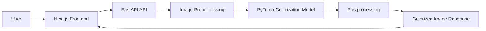
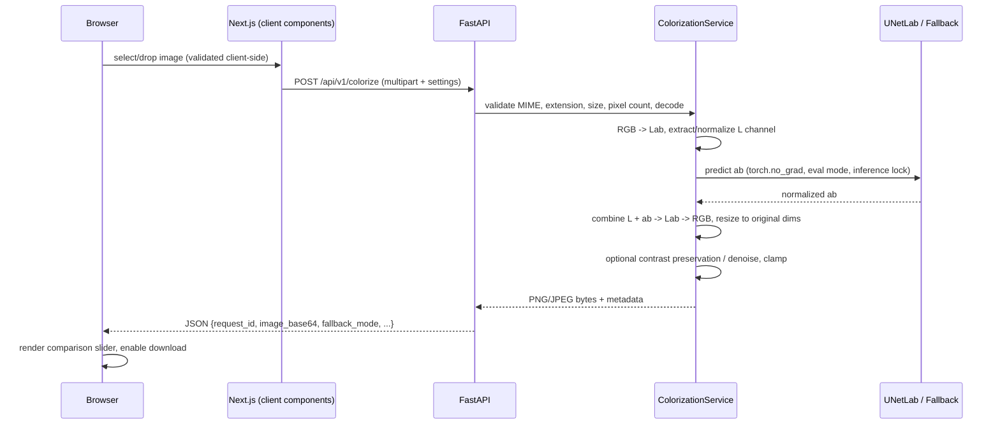
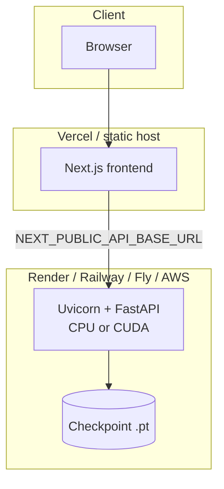

# Architecture

ColorRevive separates three concerns: an interactive web client, a stateless
inference API, and an offline training pipeline. They communicate only through
HTTP and checkpoint files.

## System overview

## Request lifecycle

## Component responsibilities

| Layer | Code | Responsibility |
|---|---|---|
| Frontend | `frontend/app`, `components/`, `lib/` | Upload UX, validation, settings, processing states, before/after slider, downloads, model-status banner |
| API | `backend/app/api/` | Routing, multipart parsing, form validation, error envelope, request IDs |
| Services | `backend/app/services/` | Pipeline orchestration, temp-file lifecycle, encoding |
| ML | `backend/app/ml/` | Lab preprocessing, U-Net definition, checkpoint loading (strict shape validation), inference + deterministic fallback |
| Training | `model-training/src/` | Dataset, losses, training loop, evaluation, batch inference — never imported at serve time |

## Key design decisions

- **Lab color space.** The network sees only luminance (L) and predicts
  chrominance (a, b). Lightness stays exact; the model only learns hue/saturation.
- **Model loaded once.** `ColorizationModel.load()` runs at startup (guarded by
  a lock); requests reuse the resident model. A per-model threading lock
  serializes CPU inference.
- **Graceful degradation.** A missing/corrupt/incompatible checkpoint falls back
  to a deterministic heuristic and flips `fallback_mode: true` in every response
  — the UI can never accidentally claim neural results.
- **Swappable architecture.** Checkpoint loading goes through
  `checkpoint_loader.load_checkpoint(path, config)`; adding a ResNet encoder
  means implementing a new builder, not touching the API layer.
- **Response strategy is configurable.** Base64 JSON (default, deployment-free)
  vs. stored-file URLs (`ENABLE_PERSISTENT_STORAGE`) to avoid huge payloads.
- **Training/serving isolation.** `model-training/` mirrors the architecture so
  state dicts are interchangeable, but shares no import-time dependency.

## Deployment topology

