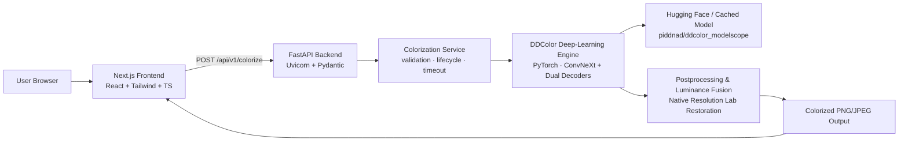
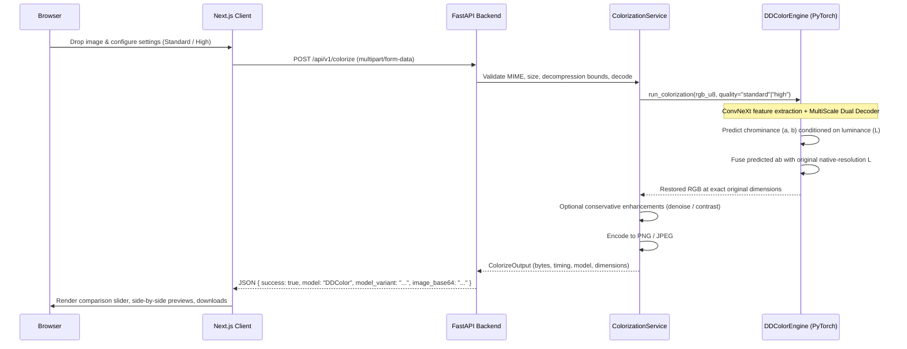

# Architecture

ColorRevive separates three concerns: an interactive Next.js web client, a high-performance FastAPI inference backend, and an offline training/evaluation pipeline.

## System Overview

## Request Lifecycle

## Component Responsibilities

| Layer | Code | Responsibility |
|---|---|---|
| **Frontend** | `frontend/app`, `components/`, `lib/` | Image upload, validation, quality settings, comparison slider, history, model status indicators |
| **Backend API** | `backend/app/api/` | HTTP endpoints (`/colorize`, `/health`, `/info`, `/model-status`, `/validate-image`), error taxonomy |
| **Pipeline Service** | `backend/app/services/` | Image decoding, thread-pool isolation, timeout enforcement, output encoding, cleanup |
| **ML Engine** | `backend/app/ml/ddcolor_engine.py` | Model caching, device allocation (CUDA/CPU), inference execution, dimension fidelity |
| **Model Arch** | `backend/app/ml/ddcolor/` | Pure-PyTorch implementation of DDColor dual-decoder neural network |

## Key Design Decisions

- **Pretrained Deep-Learning Model:** Replaces heuristic fallbacks with the ICCV 2023 DDColor model (`piddnad/ddcolor_modelscope`), providing genuine semantic coloring (skin, hair, foliage, sky, clothing).
- **Original Native Luminance Preservation:** The model predicts chrominance (`a`, `b`) in CIE Lab color space. During reconstruction, predicted chrominance is combined with the original high-resolution `L` channel, ensuring zero loss of sharpness or photographic texture.
- **Single Process-Level Singleton:** The neural network is initialized and warmed up exactly once at application startup. Subsequent inference calls reuse the resident model in memory.
- **Fail-Safe Integrity:** Deterministic fallback is disabled by default (`ENABLE_FALLBACK_MODE=false`). If weights cannot be loaded, the backend returns a clear `MODEL_UNAVAILABLE` error instead of misleading the user with heuristic tints.
